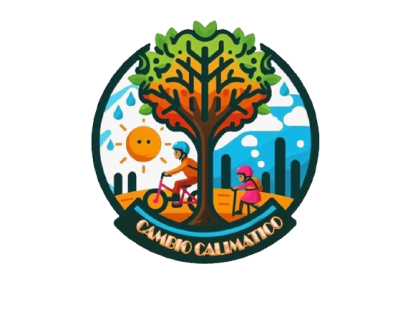

# Narración Transmedia "Cambio Calimático" - Video Interactivo "EarthGuard"

<!--  -->
<p float="left">
  
   
</p>

## Contenido general

¿Qué vas a encontrar en este repositorio?

- Sistema Multimedia Audiovisual (SMA) realizado usando Expo React Native, que consta de un video interactivo; el cual tiene como objetivo concientizar a los estudiantes de colegio, de grados 10 y 11, de la ciudad de Santiago de Cali, sobre las implicaciones del aumento de la temperatura en dos grados, frente a la edad preindustrial.

**Componentes y archivos generales**

- Archivo **activities.json** usado para almacenar toda la información asociada a cada momento del video (escenas, momentos interactivos, infografías, etc).
- Componente **App.js** usado para renderizar la aplicación general.
- Componente **CurrentVideo.js** usado para renderizar la escena actual del video interactivo.
- Componente **CurrentActivity.js** usado para renderizar la actividad o momento interactivo asociado a la escena actual.
- Componente **GuideMenu.js** usado para renderizar la guía de infografías que aparece al final de la experiencia.

Este SMA funciona en smartphones de gama media-baja y es comedido en el uso de recursos; además, no depende de la red para funcionar.

# Cómo usar

Para clonar y ejecutar este proyecto, tendrás que instalar:

- [Git](https://git-scm.com/) (viene con [npm](https://www.npmjs.com/))
- [Node.js](https://nodejs.org/en/download/) (viene con [npm](https://www.npmjs.com/))

Cuando completes todas las instalaciones, puedes clonar el repositorio e instalar las dependencias:

## Clona este repositorio

```
 git clone https://github.com/Tatiespi/interactive-video-app.git
```

## Ingresa al repositorio

```
 cd interactive-video-app
```

## Instala las dependencias

```
 npm install
```

## Ejecuta el proyecto

Una vez que hayas completado todas las configuraciones, puedes ejecutar el proyecto:

```
 npx expo start
```

## Usar el proyecto desde Android, iOS o PC

Para usar el proyecto desde las plataformas mencionadas, debes descargar e instalar la aplicación móvil [Expo Go](https://expo.dev/go) en su version de SDK 50.

# Eso es todo!

¡Ahora puedes disfrutar de este proyecto!
